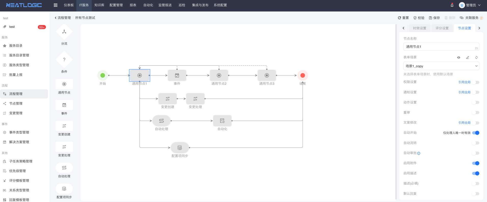

中文 / [English](README.en.md)

---

## 关于

neatlogic-itsm是it服务管理模块，自带工作流引擎、自定义表单、服务目录、SLA管理等功能。

## 主要功能

### 工作流

自带通用、条件、定时等内置节点，如果激活了其他功能模块，还能使用自动化、配置项同步、变更等专用节点。
支持串行、并行、条件、汇聚、分流、回退等流转方式。
支持通过扩展的方式实现自定义节点。

- 支持调用第三方接口，流程提供自动处理节点，用于在流程中调用第三方接口。
- 支持webhook触发器，工单或某个节点在指定状态下，触发调用第三方接口动作。
- 支持节点自动开始、自动流转。
- 支持复杂的工单分派逻辑，包括指定分派到人员、组织、角色、干系人、前置步骤处理人指定、或根据表单值指定。

### SLA

基于策略的SLA计算方式。

- 支持精确到工单的时效策略。
- 支持精确到节点的时效策略。
- 支持根据优先级、影响范围、上报人是否VIP等设置动态时效。
- 支持任务超时或临期通知。
- 支持任务超时或临期自动转派。

### 服务目录

- 支持自定义服务目录及层级关系。
- 支持自定义服务优先级、服务类别、服务上报权限等。

### 工单中心

工单中心允许用户根据个人角色预设各种搜索条件，方便跟踪各类工单。

## 功能列表

<table border="1"><tr><td>编号</td><td>分类</td><td>功能点</td><td>说明</td></tr><tr><td>1</td><td rowspan="13">流程</td><td rowspan="2">流程组件</td><td>根据平台加载的模块，自动加载对应的模块内的流程组件，如：事件、问题、变更、发布、自动化、自定义发布、接口调用组件等。</td></tr><tr><td>2</td><td>支持用户二次开发定义流程组件，如OA系统的审批、堡垒机授权等场景。</td></tr><tr><td>3</td><td rowspan="11">流程管理</td><td>支持用户自定义运维管理服务流程，支持图形化拖拉拽布局设计。</td></tr><tr><td>4</td><td>流程支持导出、导入，可用于流程在不同环境迁移。</td></tr><tr><td>5</td><td>支持复制现有流程，用于创建与原流程相似的新流程。</td></tr><tr><td>6</td><td>流程支持并行、串行、条件节点，可做汇聚、分流，回退流转路径。</td></tr><tr><td>7</td><td>流程中的节点支持自动开始处理、自动流转设置。</td></tr><tr><td>8</td><td>流程支持用户自定义个性化表单，且支持不同的流程步骤隐藏或禁用部分表单数据。</td></tr><tr><td>9</td><td>流程步骤支持用户自定义个性化的动作，如催办、取消、修改上报内容等配置。</td></tr><tr><td>10</td><td>流程步骤支持用户自定义步骤的通知策略、通知动作、通知内容。</td></tr><tr><td>11</td><td>流程步骤支持用户自定义步骤的外部调用动作，如流程状态变化，实时同步给第三方系统。</td></tr><tr><td>12</td><td>流程提供自动处理节点，用于在编排中调用第三方接口。</td></tr><tr><td>13</td><td>流程提供自动化节点、CMDB节点，可实现平台产品数据和场景闭环。</td></tr><tr><td>14</td><td rowspan="9">表单</td><td rowspan="9">表单管理</td><td>支持用户自定义表单，支持拖拉拽方式的表单布局。</td></tr><tr><td>15</td><td>提供丰富的组件，包括：文本、富文本、时间、密码、下拉、级联下拉、下拉树、超链接、附件上传、用户选择器、表格选择器、表格输入等组件。</td></tr><tr><td>16</td><td>支持同一个表单，在不同的流程节点上，支持设置不同的查看，编辑权限。</td></tr><tr><td>17</td><td>支持表单数据联动，如：表单控件A的值发生改变后，可自动对另一个控件B做显示、隐藏、禁用、赋值、过滤等操作。</td></tr><tr><td>18</td><td>表单设计过程中，支持预览。</td></tr><tr><td>19</td><td>支持表单的表格化布局方式，支持合并行、列等操作。</td></tr><tr><td>20</td><td>支持表单的版本管理，可快速切换指定版本，支持记录版本信息。</td></tr><tr><td>21</td><td>支持复制现有表单，用于创建与原表单类似的新表单。</td></tr><tr><td>22</td><td>表单支持导出、导入，可用于在不同环境的迁移表单。</td></tr><tr><td>23</td><td rowspan="11">服务目录</td><td rowspan="3">服务类型</td><td>支持用户新增、修改、删除服务类型。</td></tr><tr><td>24</td><td>支持常用的服务类型定义，如：事件、问题、变更、发布等。</td></tr><tr><td>25</td><td>支持不同服务类型工单自定义显示颜色、工单序列号生成规则，如：类型+年月日+当天同类型的工单量。</td></tr><tr><td>26</td><td rowspan="2">服务目录</td><td>支持用户新增、修改、删除服务目录。</td></tr><tr><td>27</td><td>支持无限制的服务目录层级，支持服务目录设置权限、自定义服务目录的上报帮助。</td></tr><tr><td>28</td><td rowspan="6">服务通道</td><td>支持用户新增、修改、删除服务通道。</td></tr><tr><td>29</td><td>支持多个服务通道可对应一个管理服务流程。</td></tr><tr><td>30</td><td>支持服务通道优先级、服务类型、服务窗口、服务范围(权限)、服务通道帮助等配置。</td></tr><tr><td>31</td><td>支持服务通道指定是否支持移动端使用。</td></tr><tr><td>32</td><td>支持根据服务通道、服务窗口、优先级动态匹配SLA策略。</td></tr><tr><td>33</td><td>支持服务通道快速搜索、收藏。</td></tr><tr><td>34</td><td rowspan="5">工单面板</td><td rowspan="5">工单中心</td><td>支持自定义用户角度的个人代办分类，如：我的上报、待我处理、我所在组待处理、我参与工单等类型。</td></tr><tr><td>35</td><td>支持按工单类型，配置工单查看权限。</td></tr><tr><td>36</td><td>同时支持卡片、列表方式展示工单数据，超时工单提供红色超时标识。</td></tr><tr><td>37</td><td>支持工单的简单查询条件和复杂的组合条件检索。</td></tr><tr><td>38</td><td>用户可根据上报人、处理人、上报通道、是否超时等条件，创建个人工单分类，在工单中心生成固定菜单。</td></tr><tr><td>39</td><td rowspan="5">任务分派</td><td rowspan="3">人工指派</td><td>支持指定分派到人员、组织、角色、干系人（例如上报人、待报人）。</td></tr><tr><td>40</td><td>支持服务台或具备权限用户人工干预转派工单的处理人、组、角色。</td></tr><tr><td>41</td><td>支持由前置步骤处理人指定下游节点处理人。</td></tr><tr><td>42</td><td rowspan="2">自动分派</td><td>支持根据表单值动态分派到处理人、组、角色。</td></tr><tr><td>43</td><td>支持复杂分派器动态分派处理人。例如，按工作量平均分配，分派至上报人部门领导等。</td></tr><tr><td>44</td><td rowspan="3">用户报障</td><td rowspan="3">服务上报</td><td>支持用户PC端、移动端快速发起故障上报。</td></tr><tr><td>45</td><td>支持具备权限用户通过导入文件方式的批量上报，事后补单。</td></tr><tr><td>46</td><td>支持具备权限用户或服务台代替他人发起问题上报。</td></tr><tr><td>47</td><td rowspan="8">工单处理</td><td rowspan="8">工单流转</td><td>支持工单的流转、驳回、取消、管理干预等操作。</td></tr><tr><td>48</td><td>支持工单上报、处理过程、活动日志等操作审计。</td></tr><tr><td>49</td><td>支持在工单处理过程中转交、请求协助、咨询流转操作。</td></tr><tr><td>50</td><td>支持工单内容同步到知识库，生成知识库文档。</td></tr><tr><td>51</td><td>支持工单在处理过程中关联、转报其他服务工单。</td></tr><tr><td>52</td><td>支持记录工单生命周期的操作日志，包括表单修改、回复、附件上传、工单流转、回退等生命周期的所有变化均记录在案。</td></tr><tr><td>53</td><td>支持查看工单流程图，全局查看工单进度。</td></tr><tr><td>54</td><td>处理人视角支持工作台模式，快速切换当前用户的多个待处理任务。</td></tr><tr><td>55</td><td rowspan="5">时效</td><td rowspan="5">SLA时效</td><td>支持精确到工单的时效策略，以工单为单位统计时效。</td></tr><tr><td>56</td><td>支持精确到节点的时效策略以单节点或多节点为单位统计时效。</td></tr><tr><td>57</td><td>支持根据优先级、影响范围、上报人是否VIP等设置动态时效，可根据优先级、影响范围、上报人是否VIP等设置动态时效。</td></tr><tr><td>58</td><td>支持任务超时或临期通知，可配置超时自动通知，通知时间点可自定义，如超时前N分钟通知，或超时N分钟后通知；通知接收人可自定义。</td></tr><tr><td>59</td><td>支持任务超时或临期自动转派，可配置超时自动转派策略，转派时间可自定义，如超时前N分钟转派，或超时N分钟后转派；转派对象可自定义。</td></tr><tr><td>60</td><td rowspan="5">通知</td><td rowspan="2">通知模板</td><td>通知内容支持设置通知模板，通知模板可引用工单信息（包括但不限于工单号、工单标题、服务路径、上报内容、上报人、工单状态、优先级等）。</td></tr><tr><td>61</td><td>通知对象可以设置为工单的干系人（如上报人、处理人等），也可指定用户，角色。</td></tr><tr><td>62</td><td rowspan="3">通知策略</td><td>支持通知途径包括电话、短信等，通知插件支持用户二次开发。</td></tr><tr><td>63</td><td>支持用户自定义通知动作点，如：流程步骤激活、转交、完成、回退等。</td></tr><tr><td>64</td><td>支持代办任务定时催办通知，如我的代办事项、我所在组的代办事项催办通知等。</td></tr><tr><td>65</td><td rowspan="2">满意度评价</td><td>评分模板</td><td>支持用户自定义评分模板，设置评分维度，并与流程关联。实现不同流程采用不同的评分维度</td></tr><tr><td>66</td><td>自动评分</td><td>支持用户在一定的时间窗口内评分，超过时间窗口流程步骤自动关闭。</td></tr><tr><td>67</td><td rowspan="3">移动端</td><td>服务上报</td><td>支持服务端用户快速发起对应的服务通道问题上报登记。</td></tr><tr><td>68</td><td>工单中心</td><td>移动端与PC端操作界面一致，支持数据检索、工单分类、工单流转。</td></tr><tr><td>69</td><td>工单流转</td><td>移动端与PC端操作界面一致，支持转交、回退、完成等常规流转操作。</td></tr><tr><td>70</td><td rowspan="6">知识库</td><td>知识库模板</td><td>支持知识库模板定义，简化和约束添加知识的规范。</td></tr><tr><td>71</td><td rowspan="4">知识库</td><td>支持知识库的基础管理功能，以及对应知识库类型发布审批、版本管理功能。</td></tr><tr><td>72</td><td>支持知识库的版本比对，高亮显示版本差异。</td></tr><tr><td>73</td><td>支持markdown语法、代码块等高亮展示。</td></tr><tr><td>74</td><td>支持工单直接生成知识。</td></tr><tr><td>75</td><td>知识权限</td><td>支持自定义知识圈、自定义知识圈成员，审批成员，具备对应的权限可访问对应的知识库。</td></tr></table>                                                  |

